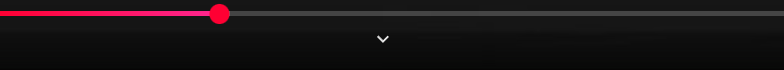

# yt-remove-chevron-scroll

If you like me hates this "scroll of doom" that youtube UX has been added
just to make you crazy.

Now you have an alternative to disable (without lose the mouse action of scroll down if you really want to see the extra content)

**Before**

**After**

That's why **yt-remove-chevron-scroll** has been created

Open issues if you feel that has some potentials updates or contribuite if you feel
like it. Feel free to use.

> PS:
> For this moment is only chrome based browser (about to 64.4% of market share based on [Browserstack 2024 research](https://www.browserstack.com/guide/understanding-browser-market-share)), but why not in future has firefox too? Who knows.
